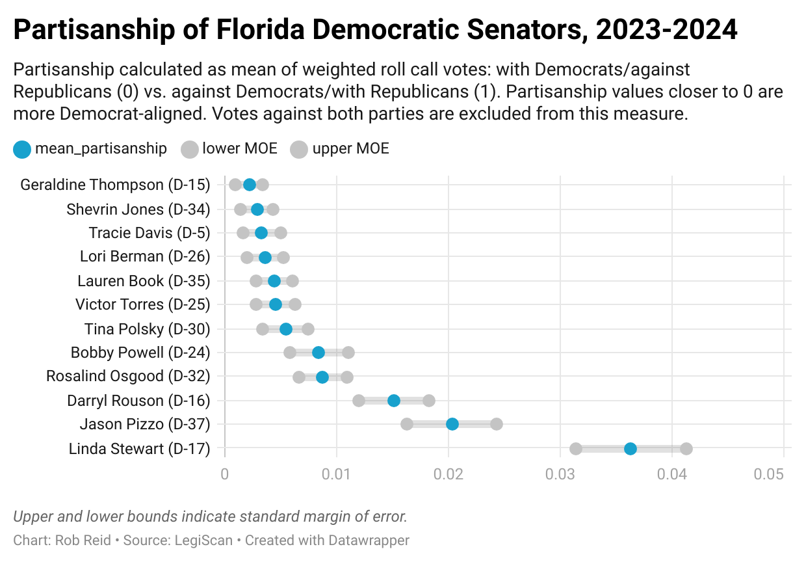

# Florida Legislative Voting Database
7/5/24

 This repo develops an existing data pipeline supporting the ongoing development of the [Jacksonville Tributary's](https://jaxtrib.org/) legislative voting dashboard (see [prior version of demo app](https://shiny.jaxtrib.org/)). The purpose of the dashboard is to highlight voting patterns of Florida legislators, which can help answer questions about:
* actual voting records of legislators as a tangible measure of their political leanings (compared to campaign rhetoric)
* partisan/party-line voting
* disparities between legislators and the demographics/political leanings of the districts they represent

My focus here is adapting [apantazi's R-scripted data pipeline](https://github.com/apantazi/legislator_dashboard/blob/main/pull-in-process-all-legiscan.R) into a Postgres database, while improving its maintainability and scalability. I'm improving data integrity and reliability by re-shaping nested lists (from API-acquired JSONs and R scripts) into relational database format and creating curated views of processed data. My intent is to make it easier for web app developers and data visualization specialists to:
* adapt existing reporting tools to different jurisdictions besides the state of Florida- for example, Jacksonville via LegiStar data
* create new visualizations using any programming language (not just R) and connecting via Postgres/SQL or loading CSV files
* highlight contextual data (e.g. demographics and district electoral preferences) related to legislator voting records
* avoid the need for deduplicating or cleaning data
* have greater control over the presentation of data including sorting, hover text formatting, and filtering

7/5/24 updates
* integrates Census and election results data
* integrates user-entered data on bill categorization and flagging contested electoral districts

## Overview of the database


Note that the database currently integrates data from only LegiScan, supporting a single Shiny app.

|Layer|Purpose|
|---|---|
|**Raw**|Raw data retrieved as JSON via API, then parsed into tables with data elements retained unmodified. This layer also includes some limited user-entered data.|
|**Processed**|Cleaned and organized data including calculated fields. My intent is to also to align and integrate data between similar formats (e.g. LegiScan and LegiStar).|
|**Application**|Data prepared for specific applications such as the legislator dashboard.|

ETL in the context of this legislative dashboard database means:
* **Extract** data via API from Legiscan, then parse it into tables in the raw layer.
* **Transform** data by cleaning, organizing, calculating, and aligning data so it's more useful and easier to understand
* **Load** the transformed data into the Postgres database

<br>

## Raw Layer
### raw-legiscan schema ###
* [Data Dictionary for raw_legiscan](docs/data-dictionary-raw-legiscan.xlsx)

This database acquires only a portion of LegiScan data (see LegiScan's [entity relationship diagram](https://api.legiscan.com/dl/Database_ERD.png) and [API user manual](https://legiscan.com/misc/LegiScan_API_User_Manual.pdf) for info on all available data). LegiScan's data is provided as three folders of JSON files- votes (which are really roll calls, with individual votes nested within), people (i.e. legislators), and bills (with lots of related info nested within).

The raw data layer stores data parsed from the original JSON files but otherwise unaltered from the source format. It's organized as follows, with one row of data per unique combination of the primary key listed below.

|Table|Primary Key|Description and Notes|
|---|---|---|
|t_bills|bill_id|One record per bill. Note that bills can persist across multiple legislative sessions.|
|t_legislator_sessions|person_id,<br>session|Because legislators can change roles (i.e. move from the House to the Senate), one record is tracked per legislator per legislative session.|
|t_roll_calls|roll_call_id|One record per roll call. Includes summary data on roll calls (e.g. how many voted yea vs. nay, etc.)|
|t_legislator_votes|person_id,<br>roll_call_id|One record per legislator per roll call vote. Including data on how the legislator voted (yea, nay, absent, no vote).|

### raw-daves schema ###
State Congressional district data downloaded from [Dave's Redistricting](https://davesredistricting.org/). This includes American Community Survey (2020), Citizen Voting Age Population (2022), and metrics of partisan preference based on state governor and Presidential election results from 2016 to 2020.
|Table|Primary Key|Description and Notes|
|---|---|---|
|t_districts_house|district_id|One record per house district based on 2022 map.|
|t_districts_senate|district_id|One record per senate district based on 2022 map.|


### user-entry schema ###
This schema includes a limited amount of user-entered data as a prototype. This data generation should be automated whenever that's more efficient (e.g. by bill committee assignments/ AI text search, election race data).
|Table|Primary Key|Description and Notes|
|---|---|---|
|[user_bill_categories](https://docs.google.com/spreadsheets/d/1ivNJS9F6TyBjTr_D3OmUKxN0YCEM9ugLbJRteID6Q24/edit?usp=drive_link)|bill_number,<br>session_biennium,<br>bill_category|User assignment of bills to categories. This may be automated, use AI, etc. in future iterations.|
|[user_incumbents_challenged](https://docs.google.com/spreadsheets/d/1woSZBU5bOfTGFKtuaYg2xT8jCo314RVlSpMrSARWl1c/edit?usp=drive_link)|party,<br>role,<br>district_number,<br>year|Tracks electoral districts where incumbents have primary challengers.|

<br>

## Processed Layer
The processed layer tracks data transformed from LegiScan, but is intended to eventually align data from multiple sources. Following is a list of tables in this layer. Note that "origin data sources" is intended to eventually integrate LegiScan (state) data with LegiStar (city) data.

|Table|Primary Key|Origin Data Sources|Notes|
|---|---|---|---|
|p_bills|bill_id|LegiScan (state)|Cleans up and aligns bill data from LegiScan and LegiStar|
|p_districts|district_id,<br>year|Dave's Redistricting and user-entered data on incumbent primary challenge status |One record per legislative district (Senate, House, City Council, etc.)|
|p_legislators|person_id||Summary info about legislators, which arbitrarily takes the first record for each.|
|p_legislator_sessions|person_id,<br>session_year|LegiScan (state)|Session_year is part of key because legislators can change roles (i.e. move from the House to the Senate) over time|
|p_legislator_votes|person_id,<br>roll_call_id|LegiScan (state)|Includes data on how the legislator voted (yea, nay, absent, no vote) and calculated partisan metrics (with their party, against their party, against both parties, etc.).|
|p_leg_votes_partisan|person_id,<br>roll_call_id|LegiScan (state)|Legislator votes filtered for only yea and nay votes with additional partisan metrics.|
|p_roll_calls|roll_call_id|LegiScan (state)|Includes summary data on roll calls (e.g. how many voted yea vs. nay, etc.)|
|p_sessions|session_id|LegiScan (state)|Info about each legislative session, e.g. session name and session biennium.|
|jct_bill_categories|bill_id, category|Manual data entry (for now)|Includes data on how the legislator voted (aye, nay, absent, no vote) and calculated partisan metrics (with their party, against their party, against both parties, etc.).|


<br>

## App Layer
### Voting Patterns App
This repo currently supports the legislative voting patterns tab of the Shiny app (see [prior version of demo app](https://shiny.jaxtrib.org/)). This dataset filters for roll calls where one or more party member strayed from the party line.

Data is prepared to facilitate non-Shiny app development, and includes three types of fields:
* plot data (x = legislator_name, y= roll_call_id, values = partisan metric)
* context data (bill_id, bill_number, title, url, and description; roll call description and date, roll call vote and overall vote summary) currently rendered as a pop-up tooltip when hovering over individual legislator votes
* app filter and sort data (party, chamber, district_number, session year, d_include, r_include). Bill_id is used for bill category filter.

The two key metrics in this data are as follows:
* **partisan_vote** describes each legislator vote by partisanship
    * 0 = voted with their own party, against the opposing party
    * 1 = voted against their own party, with the opposing party ("Maverick")
    * 99 = voted against both parties ("Independent")
* **mean_partisanship** describes the legislators' mean average partisan_vote across all their votes with partisan_vote as 0 or 1. Mean partisanship values closer to 0 indicate voting more in lock-step with their own party.

See [Data Dictionary for app_voting_patterns](docs/data-dictionary-app-voting-patterns.csv).

### Partisanship Data Visualizations
Here's a sample use case for creating a data visualization based on existing tables in the Postgres database. The resulting data frame is exported from this pipeline as [data-app/viz_partisanship.csv](data-app/viz_partisan_senate_d.csv) and then charted in DataWrapper (I need to review this methodology with someone with a better stats background):
 ```
viz_partisanship <- p_legislators %>%
      select(legislator_name, party, chamber, district_number, n_votes, mean_partisanship) %>%
  mutate(
    sd_partisan_vote = p_legislator_votes %>%
      filter(!is.na(partisan_vote), roll_call_date >= as.Date("2012-11-10")) %>%  # Combined filters
      group_by(legislator_name) %>%
      summarize(sd_partisan_vote = sd(partisan_vote, na.rm = TRUE)) %>%
      pull(sd_partisan_vote),
    se_partisan_vote = sd_partisan_vote / sqrt(n_votes),
    lower_bound = mean_partisanship - se_partisan_vote,
    upper_bound = mean_partisanship + se_partisan_vote,
    leg_label = paste0(legislator_name, " (", substr(chamber,1,1), "-", district_number,")")
  )

viz_partisan_senate_d <- viz_partisanship %>%
  filter(party == 'D', chamber == 'Senate')
 ```



### Ad-Hoc Data Analysis
All tables from the processed layer (except p_legislator_votes, which is currently skipped due to file size) and the application layer are exported to **[data-app](data-app/)**, enabling ad-hoc data visualizations or app creation.


<br><br>

# Guide to the Repository
Following is an overview of files in this repository:

* **[data-app](data-app/)**- data supporting web applications, in csv format
* **data-raw**- raw data in JSON format, as bulk downloaded from LegiScan's API
* **[docs](docs/)**- data dictionaries and diagrams
* **[notebooks](notebooks/)**- API exploration using Jupyter Notebook and Python
* **[scripts](scripts/)**- ETL scripts

## Naming Conventions
Clear and consistent naming conventions are essential to code maintainability. Following are naming conventions used within this data pipeline.

|Prefix|Saved in Schema|Purpose|
|---|---|---|
|app_|app|**App**lication data, which has been filtered and organized from processed data. It's intended to support specific web applications but could also support data visualizations.|
|calc_|---|Performs intermediate **calc**ulations (e.g., partisanship metrics), not stored in Postgres.|
|jct_|proc|**J**unction table, for example jct_bill_categories cross-references which categories (e.g. education, environment) each bill belongs to.|
|p_|proc|**P**rocessed data, which has been cleaned and organized from original tables. This includes newly-introduced calculated fields.|
|t_|raw|**T**ables of raw data kept intact in their original source format.|
|user_|raw|**User**-entered data, e.g. on bill categorization or contested districts.|


## Running the ETL Script
The following instructions describe the process of running the ETL scripts. The last step includes CSV export(s) to [data-app](data-app/), to facilitate app development for those who don't want to interact with our Postgres database.

To run these scripts, you'll need to know two passwords:
* password for the Postgres database
* API key for Legiscan

 Prior to running the ETL scripts, you'll need to set up and open a Docker container with the database. Then, from the command line you'll need to start the Docker container, open an interactive postgres terminal, and start the database fl_leg_votes.


 ```
 docker start my_postgres
 docker exec -it my_postgres bash
 psql -U postgres -d fl_leg_votes
```

 Then, you'll need to run [scripts/etl_main.R](scripts/etl_main.R), which calls the following scripts in sequence:

 | script                   | description              |
|--------------------------|--------------------------|
| [functions_database.R](scripts/functions_database.R)|scripts to connect to Postgres, write tables, and test inputs | 
| [01_request_api_legiscan.R](scripts/01_request_api_legiscan.R)|requests data from LegiScan via API |
| [02a_parse_legiscan.R](scripts/02a_parse_legiscan.R)|parses LegiScan JSON data|
| [02b_read_csvs.R](scripts/02b_read_csvs.R)|reads csv files including user-entered data and exported Dave's Redistricting data|
| [02z_load_raw.R](scripts/02z_load_raw.R)|saves all acquired data into Postgres as the raw layer|
| [03_transform.R](scripts/03_transform.R)|organizes and adds calculations to parsed and user-entered data|
| [03z_load_processed.R](scripts/03z_load_processed.R)|writes organized data frames (processed layer) to Postgres|
| [04_prep_app.R](scripts/04_prep_app.R)|prepares and filters data for web apps|
| [04z_load_app.R](scripts/04z_load_app.R)|writes app data to Postgres, and exports data to CSV|

<br><br>

# Development workplan
Following are some data pipeline maintenance tasks:
* Add documentation for all calculated fields in p_* layer
* Continue reconciling recordcounts and account for all disparities between tables
* Continue cleaning up code by removing temp calculation variables and renaming calculation variables for clarity
* Automate API requests via Github actions to keep legislative voting data up-to-date
* Deploy Postgres database to Heroku (for testing), then Azure (for production)

And some expansions to the data pipeline:
* Incorporate LegiStar voting data for Jacksonville and align this with state data, so it can be visualized with existing web apps

Additionally, the data pipeline revision is facilitating development of the legislative dashboard (see [repo for my revised web app work-in-progress](https://github.com/reliablerascal/fl-legislation-app-postgres)). Some early updates include the addition of legislator sorting, filtering by bill topic and contested districts, and summary stats in the legend.
