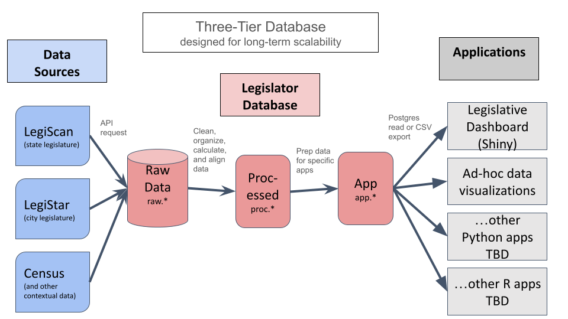

# Florida Legislative Voting Database
6/27/24
 This repo creates a data pipeline supporting the [Jacksonville Tributary's](https://jaxtrib.org/) legislative voting dashboard (see [prior version of demo app](https://shiny.jaxtrib.org/)). The ETL scripts are adapted from an [R script originally created by apantazi](https://github.com/apantazi/legislator_dashboard/blob/main/pull-in-process-all-legiscan.R). My intent is to make it easier for others to maintain/develop the app, quickly adapt it to different jurisdictions, and create new apps from the same processed data using any programming language.
 
 Part of this work has involved reshaping nested lists (from API-acquired JSONs) into relational database format, which enables storage in Postgres as well as easy export to csv or (theoretically) SQLite. The Postgres database is currently managed locally on my Windows machine, with intent to deploy to the Tributary's Azure platform.

 See also my repo for front-end application development **[legislator dashboard](https://github.com/reliablerascal/fl-legislation-app-postgres)**.

## Overview of the database


Note that the database currently integrates data from only LegiScan, supporting a single Shiny app.

|Layer|Purpose|
|---|---|
|**Raw**|Raw data retrieved via API and parsed into tables.|
|**Processed**|Cleaned and organized data including calculated fields. My intent is to also to align and integrate data between similar formats (e.g. LegiScan and LegiStar).|
|**Application**|Data prepared for specific applications such as the Jacksonville Tributary's legislator dashboard.|

ETL in the context of this legislative dashboard database means:
* **Extract** data via API from Legiscan, then parse it
* **Transform** data by cleaning, organizing, calculating, and aligning data so it's more useful and easier to understand
* **Load** the transformed data into the Postgres database


<br><br>
## Naming Conventions
Clear and consistent naming conventions are essential to code maintainability. Following are naming conventions used within this data pipeline.

|Prefix|Saved in Schema|Purpose|
|---|---|---|
|t_|raw|**T**ables of raw data kept intact in their original source format.|
|calc_|---|Performs intermediate **calc**ulations (e.g., partisanship metrics).|
|p_|proc|**P**rocessed data, which has been cleaned and organized from original tables. This includes newly-introduced calculated fields.|
|app_|app|**App**lication data, which has been filtered and organized from processed data. It's intended to support specific web applications but could also support data visualizations.|


<br><br>
## Overview of Raw Data Schema
This database acquires only a portion of LegiScan data (see LegiScan's [entity relationship diagram](https://api.legiscan.com/dl/Database_ERD.png) and [API user manual](https://legiscan.com/misc/LegiScan_API_User_Manual.pdf) for info on all available data). LegiScan's data is provided as three folders of JSON files- votes (which are really roll calls, with individual votes nested within), people (i.e. legislators), and bills (with lots of related info nested within).

The raw data schema of this database stores data parsed from the original JSON files but otherwise unaltered from the source format. It's organized as follows, with one row of data per unique combination of the primary key listed below.

|Table|Primary Key|Description and Notes|
|---|---|---|
|t_bills|bill_id|One record per bill. Note that bills can persist across multiple legislative sessions.|
|t_legislator_sessions|person_id, session|Because legislators can change roles (i.e. move from the House to the Senate), one record is tracked per legislator per legislative session.|
|t_roll_calls|roll_call_id|One record per roll call. Includes summary data on roll calls (e.g. how many voted aye vs. nay, etc.)|
|t_legislator_votes|person_id, roll_call_id|One record per legislator per roll call vote. Including data on how the legislator voted (aye, nay, absent, no vote).|

Note that this schema tracks data related to the voting patterns analysis dashboard, but not (yet) the legislative activity dashboard.

For more info on data within each table, see the [data dictionary for the raw_legiscan schema](diagrams/data-dictionary-raw-legiscan.xlsx).


<br><br>
## Overview of Processed Data Schema (placeholder)


<br><br>
## Running the ETL Script
The following instructions describe the process of running the ETL scripts. I hope to develop a SQLite and folder-of-csvs exports to facilitate app development for those who don't want to interact with our Postgres database.

To run these scripts, you'll need to know two passwords:
* password for the Postgres database
* API key for Legiscan

 Prior to running the ETL scripts, you'll need to set up and open a Docker container with the database. Then, from the command line you'll need to start the Docker container, open an interactive postgres terminal, and start the database fl_leg_votes.


 ```
 docker start my_postgres
 docker exec -it my_postgres bash
 psql -U postgres -d fl_leg_votes
```

 Then, you'll need to run etl_main.R, which calls the following scripts in sequence:

 | script                   | description              |
|--------------------------|--------------------------|
| [01_request_api_legiscan.R](scripts/01_request_api_legiscan.R)|requests data from LegiScan via API |
| [02_parse_legiscan.R](scripts/02_parse_legiscan.R)|parses LegiScan JSON data |
| [03_load_raw_tables.R](scripts/03_load_raw_tables.R)|saves parsed LegiScan data into Postgres as the View layer|
| [04_transform.R](scripts/04_transform.R)|prepares parsed data for deployment to the web app |
| [05_load_views_and_app_layer.R](scripts/05_load_views_and_app_layer.R)|writes app queries to Postgres |
| [00_install_packages.R](scripts/00_install_packages.R)|installation script which should later be repackaged as requirements |
| [functions_database.R](scripts/functions_database.R)|scripts to connect to Postgres, write tables, and test inputs |


<br><br>
## Development workplan
Following are some key goals for developing this data pipeline.
* Incorporate LegiStar voting data for Jacksonville and align this with state data, so it can be visualized with existing web apps
* Incorporate district data (e.g. census demographics and partisan leanings of the electorate) to provide context
* Develop automated CSV and SQLite exports to support non-Postgres access for data visualization and web app development
* Automate API requests via Github actions to keep legislative voting data up-to-date
* Deploy Postgres app on Azure to enable online connectivity