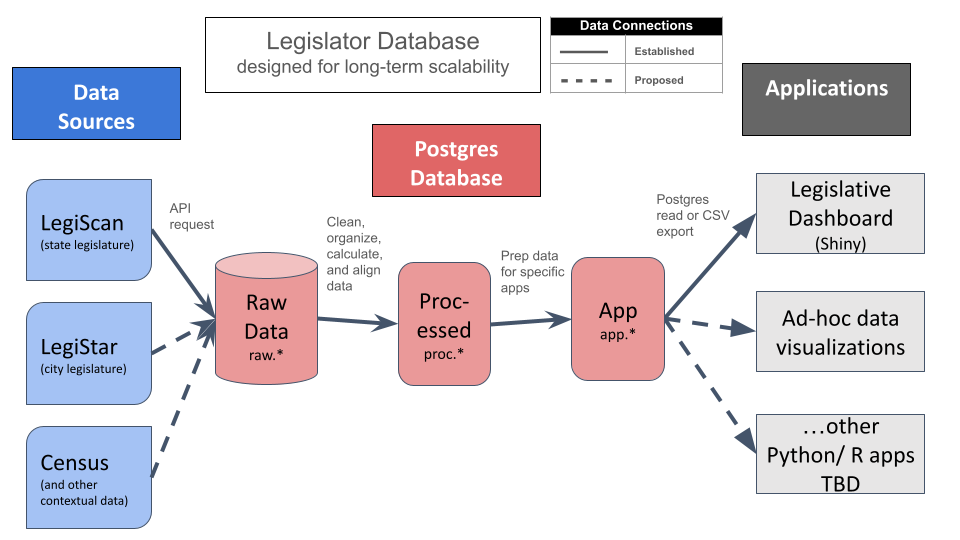
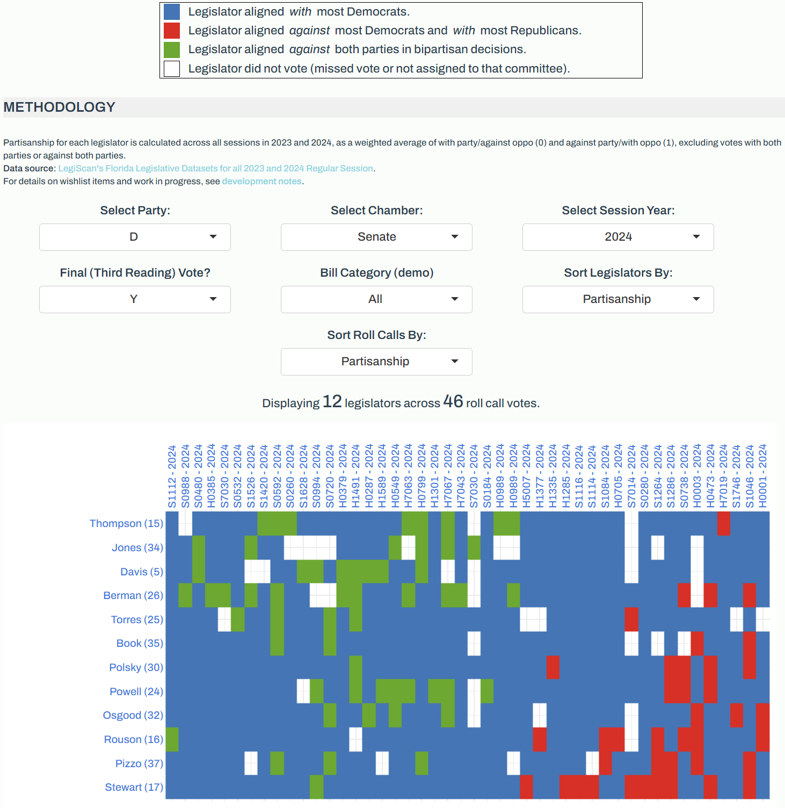
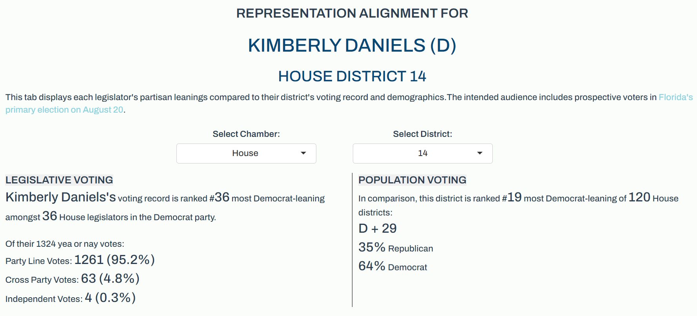
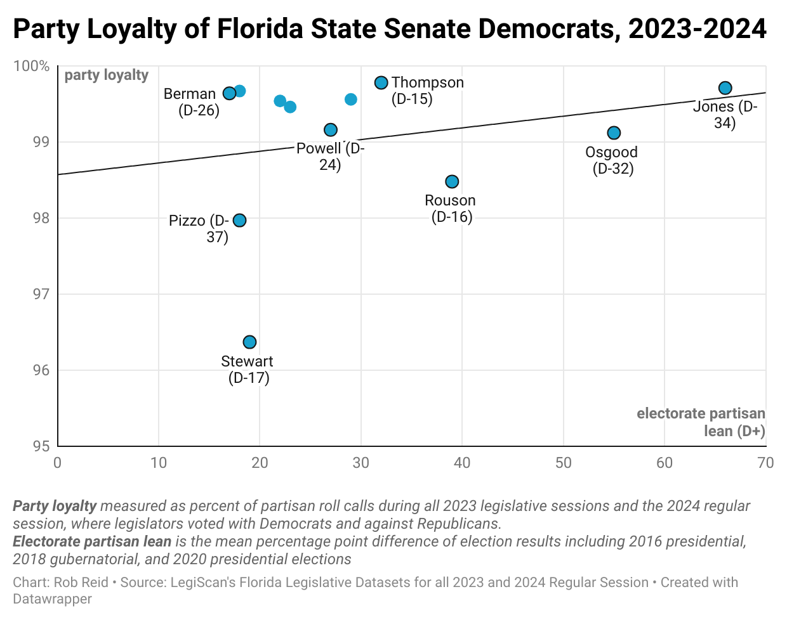

# Florida Legislative Voting Database
8/12/24

## Documentation Table of Contents
Detailed documentation is provided in the following sections:
- **Overview**- this page
- **[Database Architecture](docs/db_architecture.md)**- technical overview of data structures within the database's three layers (raw, processed, app)
- **[Web App and Data Visualization Guide](docs/app_dev_guide.md)**- specific details about data prepared for web applications and ad-hoc data visualizations (work in progress)
- **[ETL Script](docs/etl.md)**- overview of the ETL script and how to run it

### External Resources (Google Docs)
* [Procedures for ETL and Web App Development](https://docs.google.com/document/d/1MyGv2wjyfbNeb2WDrN0YXwZ2sJWINx0Oii3WKnUMDkA/edit?usp=drive_link)
* [Wishlist and Developer Notes](https://docs.google.com/document/d/1OGiJH7B_0j3B38gEtgt_FDhkxzL84ZtGistdup2yYHI/edit?usp=drive_link)
* [Development Workplan](https://docs.google.com/document/d/1_NQg5lxmVDvXwF4sC3GRQvMK21GZHCJhVurMgibe0eI/edit?usp=sharing)


<br><br>

## Project Overview
The Jacksonville Tributary is developing a **[legislative voting dashboard](https://data.jaxtrib.org/dev/legislative-compass)** to analyze roll call voting patterns of Florida state legislators, including legislators' **party loyalty** and congressional district electorates' **partisan lean** and demographics. This dashboard is intended to support development of a voter guide, reporting on party polarization, and disparities between legislators and the districts they represent.

This repo contains the data pipeline which:
* extracts [legislative voting data from LegiScan](https://legiscan.com/FL/datasets), and census and demographics data from [Daves Redistricting Maps](https://davesredistricting.org/maps#state::FL).
* transforms data by organizing and integrating data sources
* [reviews data quality](qa/qa_checks.log) to identify and explain anomalies
* loads data into a Postgres database while exporting key tables as [.csv files](data-app/)
* prepares data for use by the legislator dashboard web app:
    * [production web app](https://data.jaxtrib.org/dev/legislative-compass)
    * [staging web app](https://mockingbird.shinyapps.io/fl-leg-staging/)- currently on Rob's shinyapps, but may need a new home
    * [repo for web app](https://github.com/reliablerascal/fl-legislation-app-postgres)

### Project Status
This project is a work in progress, with the following work underway in August 2024:
* superuser journalists at partner outlets review and beta test
* publish the web app for public use (in advance of August 20 Florida primaries)
* document data definitions for web app data sources

### Key Terminology
Following are definitions of key terminology used throughout this project:
* **Party loyalty** is a legislator’s tendency to vote with or against their party. 1 = most loyal, 0 = least loyal. 
* **Partisan lean** is a legislative electorate’s partisanship as measured by percentage point difference between voting for Democrats vs. Republicans.
* **Party unity** is a roll-call-level measure, by party, of how unified roll calls are *within* parties

```
    (# votes aligned with legislator's own party)
    -----------------------------------------
    (# votes aligned with either one party or the other)
```

Calculations for **party loyalty** are based on classifying and weighing each present (yea or nay) vote. Each vote is filed into one of six categories.
|vote type| descriptino| loyalty weight
|---|---|---|
|**party line bipartisan** | voting with the same party's majority in roll calls supported by both parties | N/A |
|**party line partisan** | voting with the same party's majority in roll calls split on party lines | 1 |
|**cross party** | voting against the same party's majority in roll calls split on party lines | 0 |
|**against both parties** | voting against both party majorities | N/A |
|**absent nv** | absent or no vote | N/A |
|**other** | legislator's party is split evenly, etc. | N/A |

<br><br>

## Guide to this Repository
Following is an overview of files in this repository:

* **[data-app](data-app/)**- data supporting web applications, in csv format
* **[data-raw](data-raw/)**- raw data in JSON format, as bulk downloaded from LegiScan's API
* **[docs](docs/)**- data dictionaries, diagrams, and documentation
* **[docs](notebooks/)**- data explorations in Python, informing development of this pipeline
* **[qa](qa/)**- includes [quality assurance log](https://github.com/reliablerascal/fl-legislation-etl/blob/main/qa/qa_checks.log) and tables of data anomalies. See QA script at [scripts/qa_checks.R](scripts/qa_checks.R).
* **[scripts](scripts/)**- ETL scripts


<br><br>

## Appendix A- ETL Schematic
<br>

*Figure 1: Overview of ETL pipeline, as described in [Database Architecture](docs/db_architecture.md)*
<br><br>

## Appendix B- Sample Visualizations
For more info about all apps and visualizations, see [Web App and Data Visualization Guide](docs/app_dev_guide.md).

<div align = "left">

### Voting Patterns Dashboard

<div style = "padding-left: 20px;">


*Figure 2: Dashboard view of **Voting Patterns** web app of Senate Democrats during 2024 legislative session*
</div>

<br><br>

### District Context Web App
<div style = "padding-left: 20px;">


*Figure 3: **District Context** web app comparing a legislator's voting record with their electorate's partisan leaning*
</div>

<br><br>

<!---
### Ad-Hoc Data Visualization from District Context Data
<div style = " padding-left: 20px;">


*Figure 4: Ad-hoc Senate Democrat party loyalty vs. district electorate visualization, based on data from the **District Context** web app*
</div>
--->

</div>


