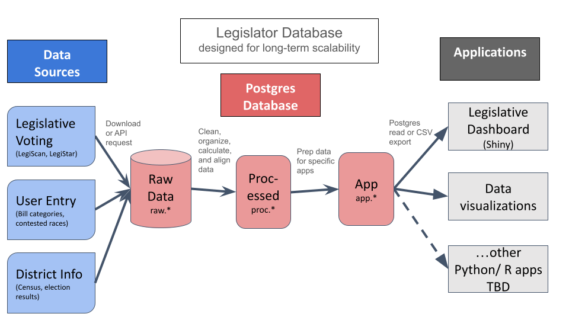
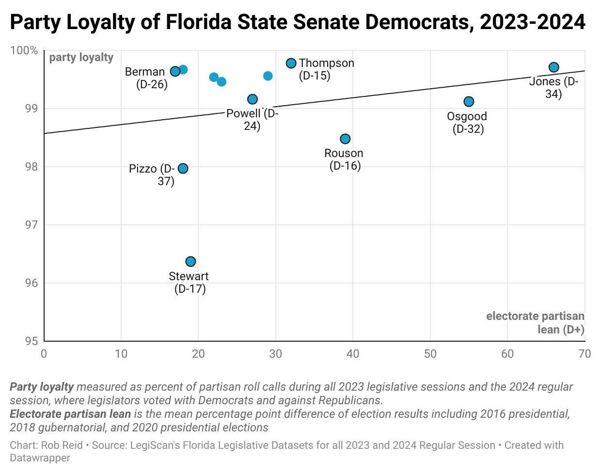

# Florida Legislative Voting Database
7/19/24

## Project Overview
The Jacksonville Tributary is developing a **[legislative voting dashboard](https://mockingbird.shinyapps.io/fl-leg-app-postgres/)** to analyze roll call voting patterns of Florida state legislators, including legislators' **party loyalty** and congressional district electorates' **partisan lean** and demographics. Building on a Shiny app [originally developed by apantazi](https://github.com/apantazi/legislator_dashboard), the dashboard is intended to support development of a voter guide, reporting on party polarization, and disparities between legislators and the districts they represent.

This repo contains the data pipeline which:
* extracts [legislative voting data from LegiScan](https://legiscan.com/FL/datasets), and census and demographics data from [Daves Redistricting Maps](https://davesredistricting.org/maps#state::FL).
* transforms data by organizing and integrating data sources
* [reviews data quality](qa/qa_checks.log) to identify and explain anomalies
* loads data into a Postgres database while exporting key tables as [.csv files](data-app/)
* prepares data for use by the [legislator dashboard web app](https://mockingbird.shinyapps.io/fl-leg-app-postgres/) (see also the [repo for the web app](https://github.com/reliablerascal/fl-legislation-app-postgres))

### Project Status
This project is a work in progress, with the following intended timeline:
* review app with journalists at partner outlets (August 2)
* publish the web app (in advance of August 20 Florida primaries)
* document data definitions for web app data sources (mid-August)
* build stories based on web app data analysis (September leading up to November 5 elections)

### Key Terminology
Following are definitions of key terminology used throughout this project:
* **Party loyalty** is a legislator’s tendency to vote with or against their party. 1 = most loyal, 0 = least loyal. 
* **Partisan lean** is a legislative electorate’s partisanship as measured by percentage point difference between voting for Democrats vs. Republicans.

Calculations for **party loyalty** are based on classifying and weighing each present (yea or nay) vote as:
* **party line**- voting with the same party's majority, regardless of the opposing party's majority vote
* **cross party**- voting against the same party's majority and with the opposing party's majority
* **against both parties**- voting against both party majorities

 

*Figure 1: Overview of ETL pipeline, as described in [Database Architecture](docs/db_architecture.md)*
  

## Documentation Table of Contents
Detailed documentation is provided in the following sections:
- [Database Architecture](docs/db_architecture.md)- technical overview of data structures within the database's three layers (raw, processed, app)
- [Web App and Data Visualization Guide](docs/app_dev_guide.md)- specific details about data prepared for web applications and ad-hoc data visualizations (work in progress)
- [ETL Script](docs/etl.md)- overview of the ETL script and how to run it
- [Development Workplan](docs/dev_workplan.md)- notes about current and future development of this data pipeline

  

## Guide to this Repository
Following is an overview of files in this repository:

* **[data-app](data-app/)**- data supporting web applications, in csv format
* **data-raw**- raw data in JSON format, as bulk downloaded from LegiScan's API
* **[docs](docs/)**- data dictionaries, diagrams, and documentation
* **[qa](qa/)**- includes [quality assurance log](https://github.com/reliablerascal/fl-legislation-etl/blob/main/qa/qa_checks.log) and tables of data anomalies. See QA script at [scripts/qa_checks.R](scripts/qa_checks.R).
* **[scripts](scripts/)**- ETL scripts

<!-- * **[notebooks](notebooks/)**- API exploration using Jupyter Notebook and Python-->

  

## Appendix- Sample Visualizations
For more info about all apps and visualizations, see [Web App and Data Visualization Guide](docs/app_dev_guide.md).

### Voting Patterns Dashboard

*Figure 2: Dashboard view of **Voting Patterns** web app of Senate Democrats during 2024 legislative session*

  

### District Context Web App

*Figure 3: **District Context** web app comparing a legislator's voting record with their electorate's partisan leaning*

  

### Ad-Hoc Data Visualization from District Context Data

*Figure 4: Ad-hoc Senate Democrat party loyalty vs. district electorate visualization, based on data from the **District Context** web app*

