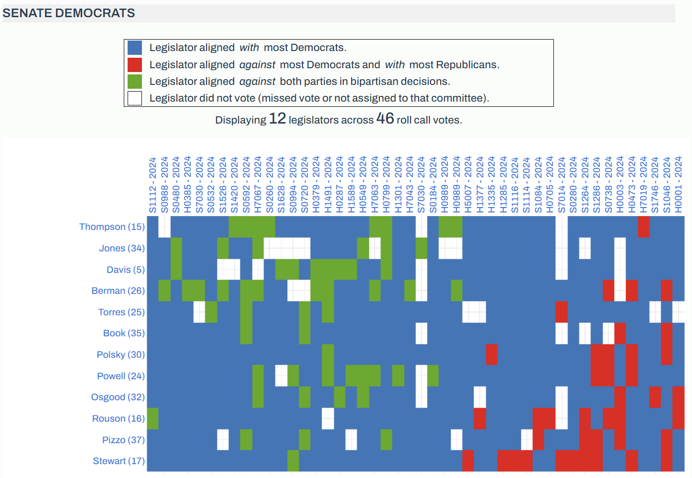

# Florida Legislative Voting Database
7/15/24

## Project Overview
The Jacksonville Tributary is developing a legislative voting dashboard to analyze roll call voting patterns of Florida state legislators, including legislators' **party loyalty** and congressional district electorates' **partisan lean** and demographics. The dashboard is intended to support development of a voter guide, reporting on party polarization, and disparities between legislators and the districts they represent.

This repo contains the data pipeline which:
* extracts [legislative voting data from LegiScan](https://legiscan.com/FL/datasets), and census and demographics data from [Daves Redistricting Maps](https://davesredistricting.org/maps#state::FL).
* transforms data by organizing and integrating data sources
* loads data into a Postgres database while exporting key tables as [.csv files](data-app/)
* prepares data for use by the [legislator dashboard web app](https://mockingbird.shinyapps.io/fl-leg-app-postgres/) (the repo for that app can be found [here](https://github.com/reliablerascal/fl-legislation-app-postgres))

### Key Terminology
Following are definitions of key terminology used throughout this project:
* **Party loyalty** is a legislator’s tendency to vote with or against their party. 1 = most loyal, 0 = least loyal.
* **Partisan lean** is a legislative electorate’s partisanship as measured by percentage point difference between voting for Democrats vs. Republicans.

 

*Figure 1: Overview of ETL pipeline, as described in [Database Architecture](docs/db_architecture.md)*
  

## Documentation Table of Contents
Detailed documentation is provided in the following sections:
- [Database Architecture](docs/db_architecture.md)- technical overview of data structures within the database's three layers (raw, processed, app)
- [Web App and Data Vidualization Guide](docs/app_dev_guide.md)- specific details 
- [ETL Script](docs/etl.md)- overview of the ETL script and how to run it
- [Development Workplan](docs/dev_workplan.md)- notes about current and future development of this data pipeline

  

## Guide to this Repository
Following is an overview of files in this repository:

* **[data-app](data-app/)**- data supporting web applications, in csv format
* **data-raw**- raw data in JSON format, as bulk downloaded from LegiScan's API
* **[docs](docs/)**- data dictionaries, diagrams, and documentation
* **[scripts](scripts/)**- ETL scripts

<!-- * **[notebooks](notebooks/)**- API exploration using Jupyter Notebook and Python-->

  

## Appendix- Sample Visualizations

*Figure 2: Dashboard view of voting patterns of Senate Democrats during 2024 legislative session, as described in the [Web App and Data Vidualization Guide](docs/app_dev_guide.md)*

  

*Figure 3: Ad-hoc Senate Democrat party loyalty vs. district electorate visualization, as described in the [Web App and Data Vidualization Guide](docs/app_dev_guide.md)*

