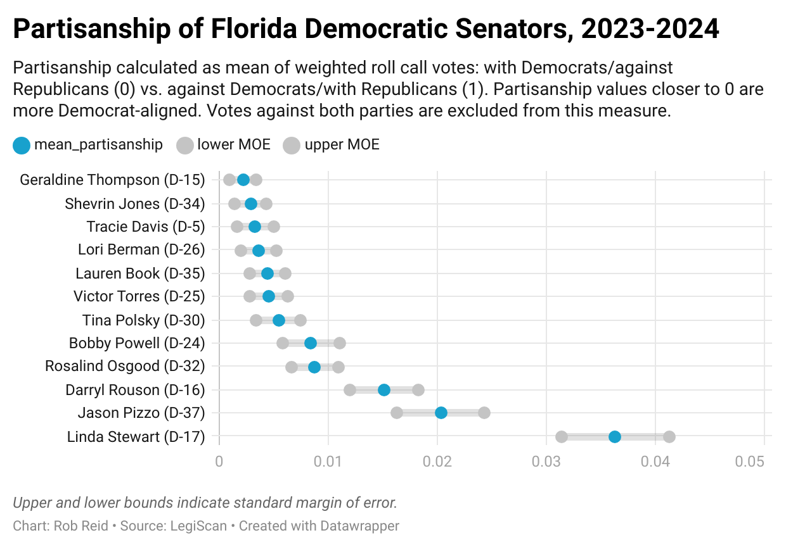
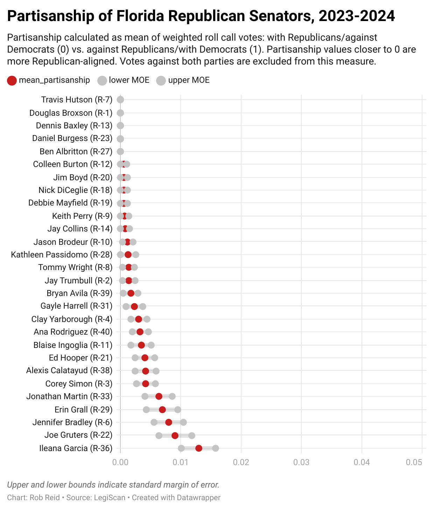
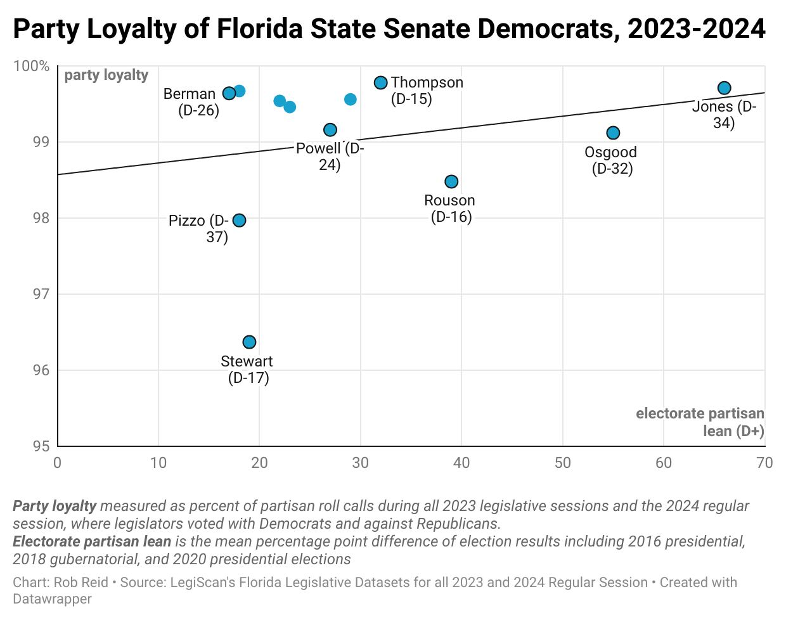

# Web App and Data Visualization Guide
7/15/24
*This section needs updating to reflect shift to "party loyalty" metric (vs. ambiguous "partisanship" metric), and to provide clear guidance for app developers. The Partisanship Data Analysis also needs to be re-created.*

## App Settings
App settings determine how partisanship and demographics are measured. These are configured at the top of [04_prep_app.R](../scripts/04_prep_app.R), and can readily be changed without breaking other aspects of the data pipeline:
* **Demographic data source**. Which data source is used for determining race/ethnic makeup of districts.
* **District partisan lean**. Choice of which election results to weigh when measuring percentage point difference in Republican vs. Democrat votes for district electorates.
* **Party loyalty metric**. For/against metric weighting is currently selected- (0 for with party against opposing party, 1 for against party and with same party). Other partisan metric options may include for/against/indy and [nominate](https://en.wikipedia.org/wiki/NOMINATE_(scaling_method)). 

## Queries Supporting All Apps
Based on these settings, the app layer includes the following foundational queries supporting all apps. Primary keys are again strictly enforced.
|Query|Primary Key|Origin Data Sources|Notes|
|---|---|---|---|
|qry_districts|chamber,<br>district_number|hist_district_demo,<br>hist_district_elections|District info including demographics and partisan lean.
|qry_leg_votes|people_id,<br>roll_call_id|p_legislator_votes|Adds weighted party loyalty counts dependent upon **partisan_vote_type** and **party loyalty metric** setting|
|qry_legislators_incumbent|chamber,<br>district_number|p_legislators|Filtered to include only incumbents (i.e. those with no termination date).|
|qry_state_summary|---|Dave's Redistricting|Summary of demographics and election results from p_districts.|

## App #1: Voting Patterns
The app layer currently supports the [Voting Patterns Analysis web app (dev version)](https://mockingbird.shinyapps.io/fl-leg-app-postgres/), a tool for Florida political journalists and policy wonks. This dataset filters for roll calls where one or more party member strayed from the party line.

Data is prepared to facilitate non-Shiny app development, and includes three types of fields:
* plot data (axes = legislator_name/district_number, roll_call_id; values = partisan metric_type)
* context data (for tooltips, etc.)
  * bill info (bill_id, bill_number, title, url, and description)
  * roll call info (description, date, party and overall vote summaries)
* filtering and sorting data (party, chamber, district_number, session year, d_include, r_include, bill_id).

The two key metrics in this data are as follows:
* **partisan_vote_type** describes each legislator vote by partisanship
    * Party Line = voted with their own party, against the opposing party
    * Cross Party = voted against their own party, with the opposing party ("Maverick")
    * Against Both Parties = voted against both parties ("Independent")
* **leg_party_loyalty** describes the legislators' mean average party loyalty across all their votes with values closer to 1 indicate voting more in lock-step with their own party.

See [Data Dictionary for app_voting_patterns](../docs/data-dictionary-app-voting-patterns.csv).
<br><br>
### App #3: District Context
Data already incorporated in this data pipeline supports a new app which compares legislative partisanship with district political leanings and demographics. The audience for this app is prospective voters in [Florida's primary election](https://ballotpedia.org/Florida_elections,_2024#Offices_on_the_ballot) on August 20.

Data supporting this app:
* [app03_district_context.csv](../data-app/app03_district_context.csv)
* [app03_district_context_state.csv](../data-app/app03_district_context_state.csv)

<!---
>See [Data Dictionary for app03_district_context](docs/data-dictionary-app03_district_context.csv) and [Data Dictionary for  app03_district_context_state](docs/data-dictionary-app03_district_context_state.csv).
--->

<br><br>

## Partisanship Data Visualizations

Here's a sample use case for creating a data visualization based on existing tables in the Postgres database. The resulting data frame is exported from this pipeline as [viz_partisanship.csv](../data-app/viz_partisan_senate_d.csv) and then charted in DataWrapper (I need to review this methodology with someone with a better stats background):
 ```
viz_partisanship <- p_legislators %>%
      select(legislator_name, party, chamber, district_number, n_votes_partisan, mean_partisanship) %>%
  mutate(
    sd_partisan_vote = p_legislator_votes %>%
      filter(!is.na(partisan_vote_type), partisan_vote_type != 99, roll_call_date >= as.Date("2012-11-10")) %>%  # Combined filters
      group_by(legislator_name) %>%
      summarize(sd_partisan_vote = sd(partisan_vote_type, na.rm = TRUE)) %>%
      pull(sd_partisan_vote),
    se_partisan_vote = sd_partisan_vote / sqrt(n_votes_partisan),
    lower_bound = mean_partisanship - se_partisan_vote,
    upper_bound = mean_partisanship + se_partisan_vote,
    leg_label = paste0(legislator_name, " (", substr(chamber,1,1), "-", district_number,")")
  )

viz_partisan_senate_d <- viz_partisanship %>%
  filter(party == 'D', chamber == 'Senate')

viz_partisan_senate_r <- viz_partisanship %>%
  filter(party == 'R', chamber == 'Senate')
 ```





## Ad-Hoc Data Analysis
All tables from the processed layer (except p_legislator_votes, which is currently skipped due to file size) and the application layer are exported to **[data-app](../data-app/)**, enabling ad-hoc data visualizations or app creation.

For example, Andrew suggested that [data prepared for the district context app](../data-app/app03_district_context.csv) could be used to create a scatterplot comparing party loyalty against electorate partisan lean. I did so in DataWrapper for Senate Democrats.<br><br>

<br><br>
