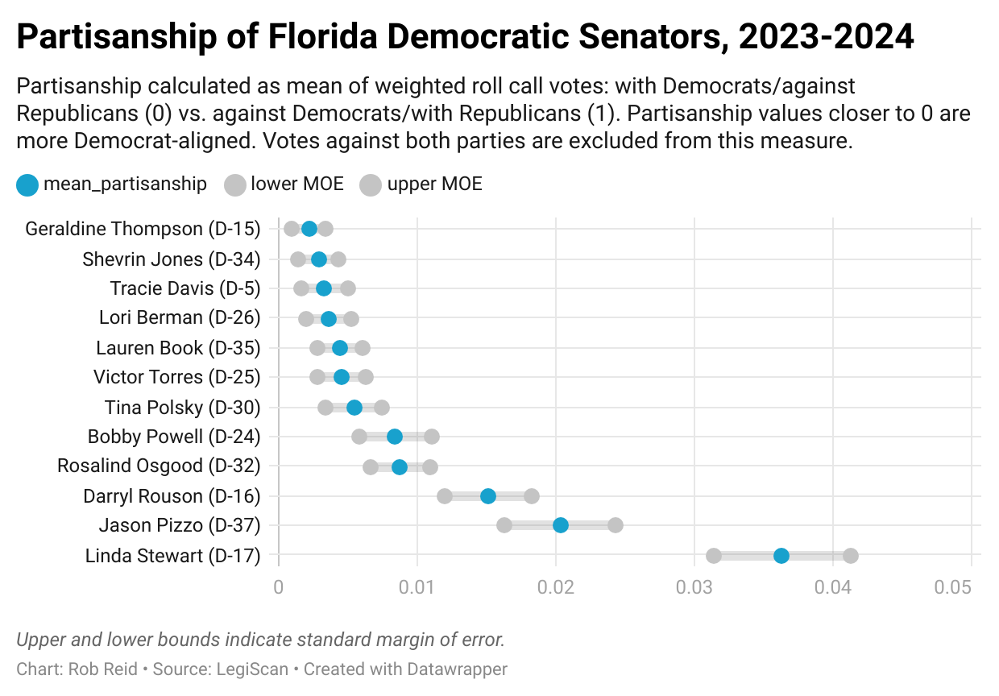
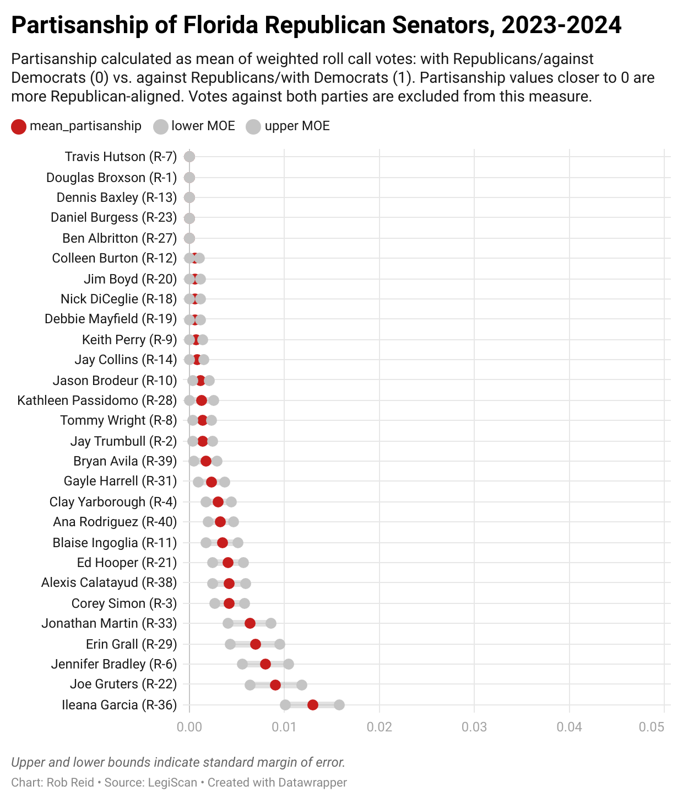

# Web App and Data Visualization Guide
8/23/24

*The last section of this doc needs updating to reflect shift to "party loyalty" metric (vs. ambiguous "partisanship" metric), and to provide clear guidance for app developers. The Partisanship Data Analysis also needs to be re-created.*

### Table of Contents
* [Settings](#settingssettings)
* [Base Queries](#base-queries)
* [App-Specific Data](#app-specific-data)
* [Partisanship Data Visualizations](#partisanship-data-visualizations)

<br><br>

## Settings
ETL pipeline settings determine which data is used, and how partisanship and demographics are measured in the app. Settings are typically defined at the top of their respective scripts, and can readily be changed without breaking other aspects of the data pipeline:

|Setting|Field Name |Defined in Script|Description|
|---|---|---|---|
|Toggle for staging/ production|setting_env|[functions_database.R](../scripts/functions_database.R)|Toggle switch determining whether ETL pipeline saves to the staging database or the prodution database.|
|Earliest legislative session|setting_parse_start_year|[02a_raw_parse_legiscan.R](../scripts/04_prep_app.R)|Earliest year for which LegiScan data should be parsed and stored in the pipeline.|
|Latest legislative session|setting_parse_end_year|[02a_raw_parse_legiscan.R](../scripts/04_prep_app.R)|Latest year for which LegiScan data should be parsed and stored in the pipeline.|
|Demographic data source|setting_demo_src|[04a_app_settings.R](../scripts/04a_app_settings.R)|Which data source is used for determining race/ethnic makeup of districts.|
|Demographic data year|setting_demo_year|[04a_app_settings.R](../scripts/04a_app_settings.R)|Year for reflecting demographics data.|
|Party loyalty metric|setting_party_loyalty|[04a_app_settings.R](../scripts/04a_app_settings.R)|Which method should be used for calculating party loyalty- e.g. for non-bipartisan roll calls, weigh votes as 1 with party and 0 against party.
|District partisan lean|setting_district_lean|[04a_app_settings.R](../scripts/04a_app_settings.R)|Choice of which election results to include and how much weight to assign to each when measuring each district's Republican vs. Democrat electoral leaning.|


## Base Queries
Based on these settings, a series of queries transforms data from the **processed layer**. These queries in turn support the app layer. Primary keys are again strictly enforced.
|Query|Primary Key|Origin Data Sources|Notes|
|---|---|---|---|
|[qry_bills](https://github.com/reliablerascal/fl-legislation-etl/blob/develop/data-app/qry_bills.csv)|bill_id|p_bills|
|[qry_districts](https://github.com/reliablerascal/fl-legislation-etl/blob/develop/data-app/qry_districts.csv)|chamber,<br>district_number|hist_district_demo,<br>hist_district_elections|District info including demographics and partisan lean.
|qry_leg_votes|people_id,<br>roll_call_id|p_legislator_votes|Adds weighted party loyalty counts dependent upon **partisan_vote_type** and **party loyalty metric** setting. File is too large to post on GitHub|
|[qry_legislators_incumbent](https://github.com/reliablerascal/fl-legislation-etl/blob/develop/data-app/qry_legislators_incumbent.csv)|chamber,<br>district_number|p_legislators|One legislator per each Senate and House district|
|[qry_roll_calls](https://github.com/reliablerascal/fl-legislation-etl/blob/develop/data-app/qry_roll_calls.csv)|roll_call_id|p_roll_calls||
|[qry_state_summary](https://github.com/reliablerascal/fl-legislation-etl/blob/develop/data-app/qry_state_summary.csv)|---|Dave's Redistricting|Summary of demographics and election results from p_districts.|

<br><br>

## App-Specific Data
### App #1: Voting Patterns
The app layer supports the **Voting Patterns Analysis** web app, a tool for Florida political journalists and policy wonks. This dataset filters for roll calls where one or more party member strayed from the party line. This includes three types of data:
* plot data (axes = legislator_name/district_number, roll_call_id; values = partisan metric_type)
* context data (for tooltips, etc.)
  * bill info (bill_id, bill_number, title, url, and description)
  * roll call info (description, date, party and overall vote summaries)
* filtering and sorting data (party, chamber, district_number, session year, d_include, r_include, bill_id).

The two key metrics in this data are as follows:
* **partisan_vote_type** describes each legislator vote by partisanship
    * Party Line = voted with their own party, against the opposing party
    * Cross Party = voted against their own party, with the opposing party ("Maverick")
    * Against Both Parties = voted against both parties ("Independent")
* **leg_party_loyalty** describes the legislators' mean average party loyalty across all their votes with values closer to 1 indicate voting more in lock-step with their own party.

Data supporting this app:
* [app01_vote_patterns.csv](../data-app/app01_vote_patterns.csv)

<!-- See [Data Dictionary for app_voting_patterns](../docs/data-dictionary-app-voting-patterns.csv). -->
<br><br>
### App #3: District Context
Data already incorporated in this data pipeline supports a new app which compares legislative partisanship with district political leanings and demographics. The audience for this app is prospective voters in [Florida's primary election](https://ballotpedia.org/Florida_elections,_2024#Offices_on_the_ballot) on August 20.

Data supporting this app:
* [app03_district_context.csv](../data-app/app03_district_context.csv)
* [app03_district_context_state.csv](../data-app/app03_district_context_state.csv)


<br><br>

## Partisanship Data Visualizations

Here's a sample use case for creating a data visualization based on existing tables in the Postgres database. The resulting data frame is exported from this pipeline as [viz_partisanship.csv](../data-app/viz_partisan_senate_d.csv) and then charted in DataWrapper (I need to review this methodology with someone with a better stats background):
 ```
viz_partisanship <- p_legislators %>%
      select(legislator_name, party, chamber, district_number, n_votes_partisan, mean_partisanship) %>%
  mutate(
    sd_partisan_vote = p_legislator_votes %>%
      filter(!is.na(partisan_vote_type), partisan_vote_type != 99, roll_call_date >= as.Date("2012-11-10")) %>%  # Combined filters
      group_by(legislator_name) %>%
      summarize(sd_partisan_vote = sd(partisan_vote_type, na.rm = TRUE)) %>%
      pull(sd_partisan_vote),
    se_partisan_vote = sd_partisan_vote / sqrt(n_votes_partisan),
    lower_bound = mean_partisanship - se_partisan_vote,
    upper_bound = mean_partisanship + se_partisan_vote,
    leg_label = paste0(legislator_name, " (", substr(chamber,1,1), "-", district_number,")")
  )

viz_partisan_senate_d <- viz_partisanship %>%
  filter(party == 'D', chamber == 'Senate')

viz_partisan_senate_r <- viz_partisanship %>%
  filter(party == 'R', chamber == 'Senate')
 ```





## Ad-Hoc Data Analysis
All tables from the processed layer (except p_legislator_votes, which is currently skipped due to file size) and the application layer are exported to **[data-app](../data-app/)**, enabling ad-hoc data visualizations or app creation.

For example, Andrew suggested that [data prepared for the district context app](../data-app/app03_district_context.csv) could be used to create a scatterplot comparing party loyalty against electorate partisan lean. I did so in DataWrapper for Senate Democrats.<br><br>

<br><br>
