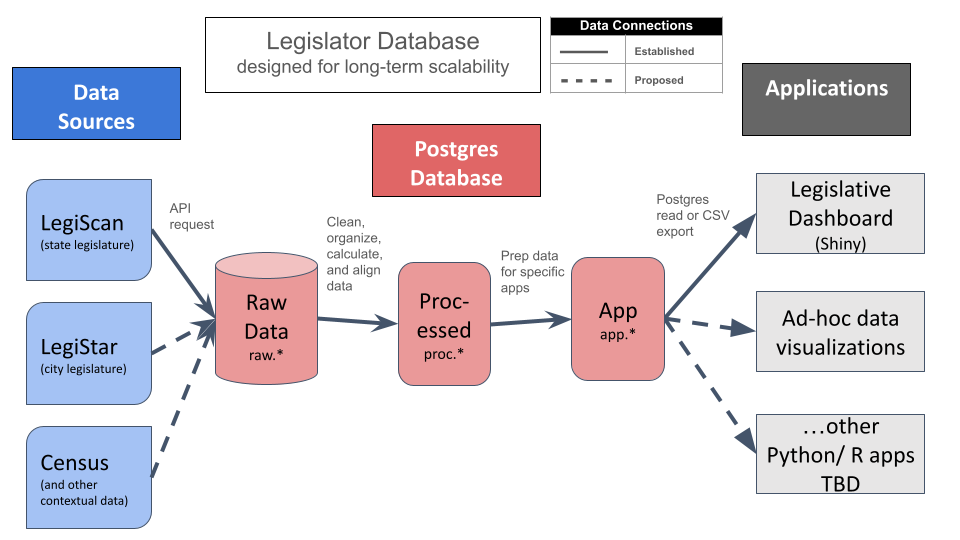

# Database Architecture
7/15/24

The Legislator Database is organized into three layers: a **raw layer** for initial data storage, processed layer for organized and aligned data, and an app layer prearing data for web apps and visualizations.

|Layer|Purpose|
|---|---|
|**Raw**|Raw data retrieved as JSON via API, then parsed into tables with data elements retained unmodified. This layer also includes some limited user-entered data.|
|**Processed**|Cleaned and organized data including calculated fields. My intent is to also to align and integrate data between similar formats (e.g. LegiScan and LegiStar).|
|**Application**|Data prepared for specific applications such as the legislator dashboard. As a rule, this layer should only access data from the processed layer.|

ETL in the context of this legislative dashboard database means:
* **Extract** data via API from Legiscan, then parse it into tables in the raw layer.
* **Transform** data by cleaning, organizing, calculating, and aligning data so it's more useful and easier to understand
* **Load** the transformed data into the Postgres database

 

### Naming Conventions
Clear and consistent naming conventions are essential to code maintainability. Following are naming conventions used within R data frames and Postgres database tables.

|Schema|Prefix|Purpose|
|---|---|---|
|raw|t_|**T**ables of raw data kept intact in their original source format.|
|raw|user_|**User**-entered data, e.g. on bill categorization or contested districts.|
|proc|hist_|**P**rocessed data, cleaned and organized from original tables and adding newly-introduced calculated fields.|
|proc|jct_|**J**unction table, for example jct_bill_categories cross-references which categories (e.g. education, environment) each bill belongs to.|
|proc|p_|**P**rocessed data, either directly processed or queried from the most recent record for each entity in the corresponding hist_* table.|
|proc, app|calc_|Data frames including intermediate **calc**ulations (e.g., partisanship metrics), which are not stored in Postgres.|
|app|qry_|**Query**, i.e. a foundational view of data supporting all apps. For example, qry_legislators_incumbents filters p_legislators for only active legislators.|
|app|qa_|**Q**uality **A**ssurance queries to facilitate further review of calculations.|
|app|app_|**App**lication data, which has been filtered and organized from processed data. It's intended to support specific web applications but could also support data visualizations.|

 

## Raw Layer
### raw-legiscan schema ###
* [Data Dictionary for raw_legiscan](../docs/data_dictionaries/data-dictionary-raw-legiscan.xlsx)

This database acquires only a portion of LegiScan data (see LegiScan's [entity relationship diagram](https://api.legiscan.com/dl/Database_ERD.png) and [API user manual](https://legiscan.com/misc/LegiScan_API_User_Manual.pdf) for info on all available data). LegiScan's data is provided as three folders of JSON files- votes (which are really roll calls, with individual votes nested within), people (i.e. legislators), and bills (with lots of related info nested within).

The raw data layer stores data parsed from the original JSON files but otherwise unaltered from the source format. It's organized as follows, with one row of data per unique combination of the primary key listed below.

|Table|Primary Key|Description and Notes|
|---|---|---|
|t_bills|bill_id|One record per bill. Note that bills can persist across multiple legislative sessions.|
|t_legislator_sessions|person_id, session|Because legislators can change roles (i.e. move from the House to the Senate), one record is tracked per legislator per legislative session.|
|t_roll_calls|roll_call_id|One record per roll call. Includes summary data on roll calls (e.g. how many voted yea vs. nay, etc.)|
|t_legislator_votes|person_id, roll_call_id|One record per legislator per roll call vote. Including data on how the legislator voted (yea, nay, absent, no vote).|

### raw-daves schema ###
State Congressional district data downloaded from [Dave's Redistricting](https://davesredistricting.org/). This includes American Community Survey (2020), Citizen Voting Age Population (2022), and metrics of partisan preference based on state governor and Presidential election results from 2016 to 2020.
|Table|Primary Key|Description and Notes|
|---|---|---|
|t_dave_districts_house|district_id|One record per house district based on 2022 district map.|
|t_dave_districts_senate|district_id|One record per senate district based on 2022 district map.|

### raw-user-entry schema ###
This schema includes a limited amount of user-entered data as a prototype. This data generation should be automated whenever that's more efficient (e.g. by bill committee assignments/ AI text search, election race data).
|Table|Primary Key|Description and Notes|
|---|---|---|
|[user_bill_categories](https://docs.google.com/spreadsheets/d/1ivNJS9F6TyBjTr_D3OmUKxN0YCEM9ugLbJRteID6Q24/edit?usp=drive_link)|bill_number, session_biennium, bill_category|User assignment of bills to categories, as a prototype for category filtering. Intent is to expand and automate this.|
|[user_incumbents_challenged](https://docs.google.com/spreadsheets/d/1woSZBU5bOfTGFKtuaYg2xT8jCo314RVlSpMrSARWl1c/edit?usp=drive_link)|party, role, district_number, year|Tracks electoral districts where incumbents have primary challengers based on [Ballotpedia info](https://ballotpedia.org/Florida_House_of_Representatives_elections,_2024).|

 

## Processed Layer
The processed layer tracks data transformed from LegiScan, census demographics, and election data. Following is a list of tables in this layer. Primary keys are enforced at this stage. To help prevent data integrity issues, the ETL script should throw an error if attempting to store records with duplicated keys in any given table. 

|Table|Primary Key|Origin Data Sources|Notes|
|---|---|---|---|
|hist_district_demo|chamber, district_number, source|Dave's Redistricting|One record per legislative district (Senate, House, etc.) per source (e.g. CVAP, ACS) with demographic data|
|hist_district_elections|chamber, district_number, election|Dave's Redistricting and user-entered data|One record per legislative district (Senate, House, etc.) per election (in this case, composite D vs. R vote for president and governor in 2016-2022)|
|hist_leg_sessions|person_id, session_year|LegiScan (state)|Session_year is part of key because legislators can change roles (i.e. move from the House to the Senate) over time|
|jct_bill_categories|bill_id, category|user-entered data|Categorization of bill by category, to support filtering options.|
|p_bills|bill_id|LegiScan (state)|Description, title, url, etc. of bills|
|p_legislators|people_id|Summary info about each legislator, based on hist_leg_sessions.|
|p_legislator_votes|person_id, roll_call_id|LegiScan (state)|Includes data on how the legislator voted (yea, nay, absent, no vote) and calculated **partisan_vote_type** (with their party, against their party, against both parties, etc.).|
|p_roll_calls|roll_call_id|LegiScan (state)|Includes summary data on roll calls.|
|p_sessions|session_id|LegiScan (state)|Info about each legislative session, e.g. session name and session biennium.|

## App Layer
See [Web App and Data Visualization Guide](../docs/app_dev_guide.md) for more info about data sources for existing and new web apps and data visualizations.

